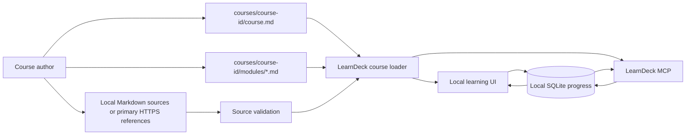

# LearnDeck course-pack standard

LearnDeck is a reusable learning app, not a DDD-only course. A **course pack**
is a portable folder of Markdown that the local UI and MCP server load in the
same order. The bundled DDD course proves the format; a fork can remove it and
seed an entirely different course without changing application code.



The boundary is deliberate: course authors own learning truth, learners own
their local answers and evidence, and the app owns only progress state.

## Folder contract

```text
courses/
  ddd-backend-foundations/
    course.md
    modules/
      00-start-a-path.md
      01-model-the-domain.md
      ...
```

LearnDeck loads one direct child folder per course pack. Each pack must contain
`course.md` and at least one `modules/*.md` file. Module filenames sort in the
learning order, so use a zero-padded numeric prefix. Course files and local
sources are Markdown; JSON course manifests are intentionally not supported.

Run this to create a valid starting pack (the ID must not already exist under
`courses/`):

```sh
bun run seed -- api-design-basics "API Design Basics"
```

The command writes a `course.md` and an `00-orient.md` module from
[`templates/course.md`](../templates/course.md) and
[`templates/module.md`](../templates/module.md). Set
`LEARNDECK_COURSES_DIR` to seed or load packs from another folder. The older
`PATCHQUEST_COURSES_DIR` variable is accepted only as a transition alias.

## `course.md`: course identity, briefing, and runtime

Every course manifest starts with YAML front matter. Its Markdown body is the
course orientation; its front matter identifies the course, supplies the
learner's briefing, and declares the runtime LearnDeck will resolve for them.

```md
---
schemaVersion: 1
id: testing-fundamentals
title: Testing Fundamentals
description: Learn to make small, trustworthy tests.
category: Engineering practice
tags:
  - Testing
  - TypeScript
overview:
  duration: 2–3 hours
  sessionLength: 25–40 minutes per module
  level: Beginner-friendly
  outcomes:
    - Design one focused test suite.
    - Explain what each test does and does not prove.
  prerequisites:
    - A workspace you control.
    - Basic familiarity with the course language.
paths:
  - id: typescript
    label: Node.js + TypeScript
    serverCommand: npm run dev
    testCommand: npm test
    workspaceHint: ../my-project
---

# Testing Fundamentals

Describe the outcome, prerequisites, and the evidence the learner will build.
```

Required fields are `schemaVersion: 1`, stable `id`, `title`, `description`, a
complete `overview` mapping, and a non-empty `paths` list. The overview needs
`duration`, `sessionLength`, `level`, and non-empty `outcomes` and
`prerequisites` lists; LearnDeck uses it to make the first screen useful before
asking for a workspace.

The bundled UI resolves the first declared runtime and asks the learner only
for their project workspace. A runtime needs a stable `id` and visible `label`.
`workspaceHint`, `serverCommand`, and `testCommand` are optional. Commands are
displayed as learner-run instructions; LearnDeck and its MCP never run them.
For a deliberately narrow course, declare one runtime. A custom fork can add a
course selection screen only when its audience genuinely needs alternatives.

`category` and `tags` are optional for compatibility, but public packs should
provide both. The LearnDeck home uses them to give people a calm way to explore
without making them read every course description first. Use one plain-language
category and two to five concrete tags.

## Module contract

Each module starts with YAML front matter, followed by its learner-facing
explanation, examples, and source links. Module metadata supplies the progress
contract; the Markdown body supplies the teaching.

```md
---
id: orient
title: Orient the learner
goal: State the outcome and establish the evidence the learner will produce.
action: Make one small, observable change in the selected workspace.
sources:
  - ./00-orient.md
  - ../../shared/testing-principles.md
questions:
  - id: orient-diagnostic
    kind: diagnostic
    prompt: What do you already know, and what evidence would show the outcome?
    reference: ./00-orient.md
    rubric:
      - Names a relevant starting understanding or uncertainty.
      - Names observable evidence rather than a vague feeling of progress.
  - id: orient-exit
    kind: exit
    prompt: Describe your evidence and the decision you can now explain.
    reference: ./00-orient.md
    rubric:
      - States learner-produced evidence.
      - Explains one decision in the course's own terms.
---

# 00 · Orient the learner

Write the learning material, worked example, and links here.
```

Required module fields are `id`, `title`, `goal`, `action`, non-empty
`sources`, and at least one question. IDs must be stable and unique throughout
the course, because progress remains attached to them after a course update.

### Sources and references

Local values in `sources` and question `reference` fields resolve relative to
the module that names them. They must point to an existing `.md` file; a heading
fragment such as `../../shared/guide.md#boundary` is allowed. Primary `https`
references are also allowed for material that cannot live in the pack.

Every question must reference the exact source an evaluator should use and
include a non-empty `rubric` list. A rubric has two to four observable
criteria: what a learner has understood, distinguished, decided, or evidenced.
It is not a hidden answer key. LearnDeck sends it to the MCP guide so feedback
can name what is solid, what is missing, and one useful next question without
writing the learner's answer. Prefer a local source snapshot for content likely
to change.

### Questions and rubrics

| Kind | Purpose | Completion effect |
| --- | --- | --- |
| `diagnostic` | Surface prior knowledge before study or action. | Never completes a module. |
| `exit` | Ask for an explanation, decision, or evidence after the action. | A correct answer can complete the module. |
| `review` | Revisit a high-value distinction in a later session. | Supports recall; does not replace evidence. |

Use one bounded action per module. A strong question asks the learner to make a
decision, contrast responsibilities, explain evidence, or trace a consequence.
Avoid keyword recitals and questions whose correct answer is not justified by a
named source.

This is a soft gate: the learner chooses whether to revise or continue. An exit
answer marked `correct` records module completion, but LearnDeck never
auto-advances the learner.

## Optional interactive Markdown blocks

Modules can embed low-stakes, local controls directly in their Markdown body.
Use a fenced `learndeck` block with a stable `id`; LearnDeck stores its value in
the learner's browser only, keyed by the local learning record and module. These are
planning and reflection aids, not evaluated answers—use the normal question
metadata for work an MCP agent should evaluate.

````md
```learndeck
type: checklist
id: before-build
label: Before you build
items:
  - I chose the workspace.
  - I can state the next small action.
```
````

Supported `type` values are:

| Type | Required fields | Learner experience |
| --- | --- | --- |
| `checklist` | `id`, `label`, `items` | Local checkboxes for a small preparation or verification list. |
| `input` | `id`, `label` | A one-line private planning note; `placeholder` is optional. |
| `textarea` | `id`, `label` | A longer private reflection; `placeholder` is optional. |
| `switch` | `id`, `label` | A deliberate true/false acknowledgement. |

Do not use controls to recreate a long form. One purposeful control after a
meaningful paragraph or practice sequence is usually enough. Use callouts in
the source body for optional context:

```md
> [!TIP]
> Keep an adapter small enough that you can replace it without changing the
> use case.
```

## Authoring checklist

1. Start from `bun run seed` or copy a course pack folder.
2. Write `course.md` with a truthful overview and one clearly resolved runtime.
3. Add zero-padded Markdown modules in the desired order.
4. Put the learner-facing lesson, examples, and source links in each module.
5. Give each module one observable action and diagnostic/exit questions; add a
   review question only for a distinction worth retaining. Give every question
   two to four author-written rubric criteria.
6. Keep local source links as `.md` files and use primary HTTPS sources where
   applicable.
7. Restart `bun run app`, create a test workspace record, submit an answer, and evaluate it
   through MCP.
8. Run `bun run verify` before sharing the pack.

The DDD pack at
[`courses/ddd-backend-foundations`](../courses/ddd-backend-foundations) is the
reference implementation of this contract.
