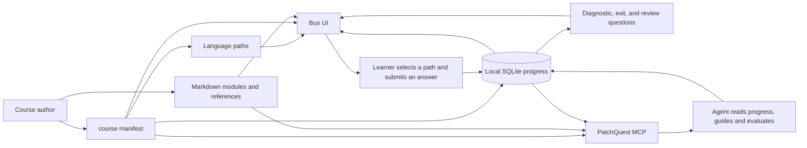

# Course authoring standard

PatchQuest separates **teaching evidence** from **course orchestration**. The
browser UI and MCP need a predictable shape; the Markdown modules and external
references remain the source a learner and agent use to reason about the work.



The diagram makes the ownership boundary clear: a course author defines
content; the learner owns code and answers; the UI and agent share local
progress but do not own the learner's workspace.

## Required source files

| Source | Owns | Does not own |
| --- | --- | --- |
| `course/<id>.json` | Ordered paths, sections, one action per section, question prompts, and source links. | Long explanations or hidden scoring rules. |
| `course/modules/*.md` | Explanations, worked examples, actions, question rubrics, and later-review prompts. | Mutable learner progress. |
| `references/*.md` | Primary sources, standards, and qualification of claims. | UI state or product code. |
| `.patchquest/progress.db` | Local paths, submissions, evaluations, reported evidence, and completion state. | Course truth; it is ignored and never committed. |

## Manifest shape

Every course manifest uses `schemaVersion: 1` and these top-level fields:

```json
{
  "schemaVersion": 1,
  "id": "short-course-id",
  "title": "Human course title",
  "description": "What the learner builds and learns.",
  "paths": [],
  "sections": []
}
```

### Paths

A path is a learner-selectable implementation route. It must specify a stable
`id`, visible `label`, a suggested `serverCommand`, `testCommand`, and a
`workspaceHint`. Commands are shown to the learner; PatchQuest never runs them.

### Sections

A section must define:

- a stable `id` and short `title`;
- one learner-visible `goal`;
- one bounded `action` that can be done in a chosen workspace;
- one or more `sources` pointing to Markdown or primary references; and
- at least one question.

Keep sections ordered as the learner should take them. The runner treats a
correct exit question as completion, but an agent should also record the
learner's reported evidence before claiming real mastery.

### Questions

Every question has a stable `id`, `kind`, open `prompt`, and `reference`.
Allowed kinds are:

| Kind | When the UI asks it | What it establishes |
| --- | --- | --- |
| `diagnostic` | Before a learner studies or acts. | Existing knowledge; never completion. |
| `exit` | After the learner reports an action/evidence. | Source-closed explanation that can complete the section. |
| `review` | In a later session. | Durable recall of a related distinction. |

Questions must be answerable from the named source and should request a
decision, contrast, explanation, or evidence—not a keyword recital. Evaluation
feedback needs a target, observed answer, exact gap or confirmation, correction,
and next action. The database preserves each revision rather than overwriting
the original answer.

## New course checklist

1. Copy the structure of `course/ddd-course.json` under a new ID.
2. Write the Markdown module and reference it from each manifest section.
3. Add no more than one bounded build action per section.
4. Add a diagnostic and exit question, plus a later review question where the
   distinction is important.
5. Start `bun run dev`, create a test path, submit an answer, and use MCP to
   record an evaluation.
6. Run `bun run verify` before sharing the course.

The DDD backend course is the reference implementation: its paths differ only
in toolchain while its sections retain the same architectural decisions.
