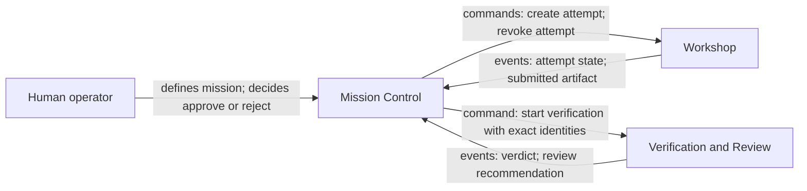

# Context map

Mission Control is upstream for mission requirements and explicitly orchestrates
mission completion. Its process manager directs Workshop to create or revoke an
attempt and directs Verification and Review to start verification. The recipient
context remains authoritative for its aggregates and publishes outcomes without
importing the Mission aggregate. `CompletionReview` publishes a recommendation
for an exact verification result. Mission Control then records a separate human
decision and alone may complete the mission.

Cross-context communication uses versioned integration contracts. Imperative
commands have one intended recipient; past-tense events publish facts. Each
context translates both into its own model. No context imports another context's
aggregate, persistence schema, or framework type.

The editable, language-neutral diagram source is
[`docs/architecture/context-map.mmd`](../../architecture/context-map.mmd).
