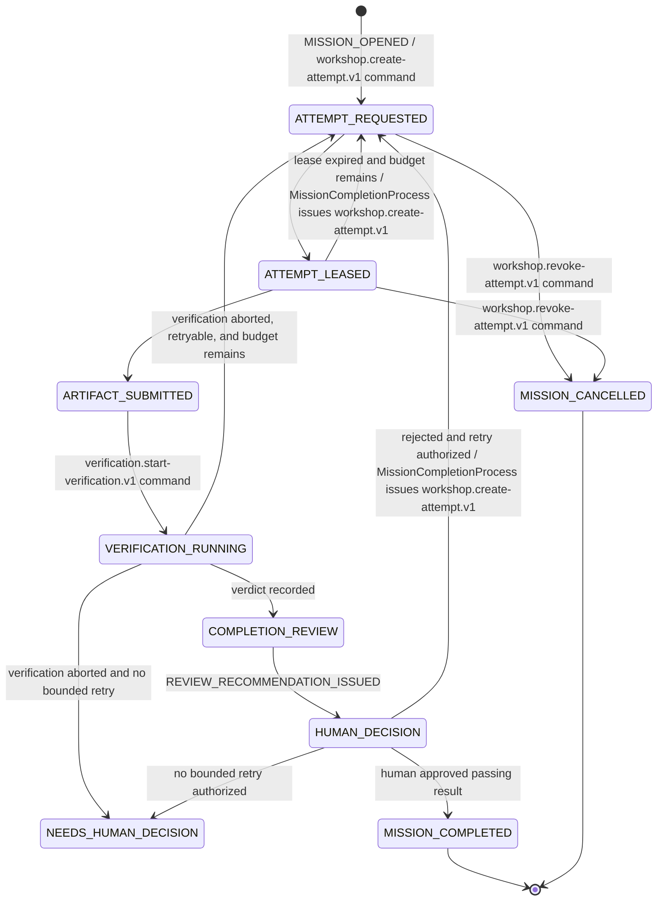

# Mission-completion workflow

`MissionCompletionProcess` is a durable process manager in Mission Control's
application layer. It records workflow progress and emits commands through an
outbox. It is not a domain entity, broker callback, gateway concern, or shared
package.

This workflow uses orchestration, not pure choreography. The process manager
consumes published facts and issues only three provider-neutral inter-context
commands: `workshop.create-attempt.v1`,
`verification.start-verification.v1`, and `workshop.revoke-attempt.v1`. These
transport contracts are distinct from each context's internal application
commands, which are not exposed wholesale.

1. A human opens a valid mission.
2. The process manager issues `workshop.create-attempt.v1` for the first
   authorized attempt. The command carries the complete immutable work
   contract: objective, starting revision, workspace reference, allowed scope,
   requested capabilities, gates, and gate-set digest. Workshop and a leasing
   runner require no hidden read back into Mission Control.
3. Workshop creates the attempt; a capable runner leases it.
4. The lease owner heartbeats and submits an immutable artifact before expiry.
5. On `workshop.artifact-submitted.v1`, the process manager issues
   `verification.start-verification.v1` for the exact mission revision, starting
   revision, gate-set digest, and artifact digest.
6. Verification publishes either a `verification.passed.v1` or
   `verification.failed.v1` gate verdict for those exact inputs. If execution
   infrastructure cannot produce a gate verdict, it instead publishes
   `verification.aborted.v1`; this is not a failed gate and opens no completion
   review. `retryable` reports whether the same bound work may be attempted
   again; it never means the aborted run itself can be converted into a verdict.
7. `CompletionReview` binds the verdict and evidence, records one immutable
   recommendation, and publishes `review.recommendation-issued.v1`.
8. Mission Control presents the bound result and recommendation to a human.
   Approval of a passing result completes the mission. Rejection preserves the
   evidence and may authorize another bounded attempt with feedback when budget
   remains; `MissionCompletionProcess` then issues
   `workshop.create-attempt.v1`. A recommendation cannot perform either
   decision. Both decisions name the exact `completionReviewId`, recommendation,
   verification run, artifact digest, gate-set digest, and evidence-bundle
   digest. If a lease expires and retry budget remains, the process manager
   likewise issues `workshop.create-attempt.v1` for the next attempt.

Cancellation can interrupt active work but never erases the audit history.
When a mission is cancelled while an attempt may still be active, the process
manager issues `workshop.revoke-attempt.v1`; Workshop owns the resulting attempt
transition and publishes the outcome as a fact.
Duplicate and redelivered messages must produce the same recorded business
effect as their first successful handling.

`verification.aborted.v1` contains the exact verification binding and an
explicit reason. For verifier, workspace, or execution-infrastructure outages,
`retryable: true` permits the process manager to authorize a new bounded
attempt only when budget remains; it does not automatically spend budget or
resume the terminal verification run. `retryable: false`, or a retryable abort
with exhausted budget, enters `NEEDS_HUMAN_DECISION`. `MISSION_CANCELLED` is
always non-retryable and follows the cancellation transition instead. An abort
never becomes `verification.failed.v1`, never fabricates failed gate IDs, and
never produces `review.recommendation-issued.v1`.
