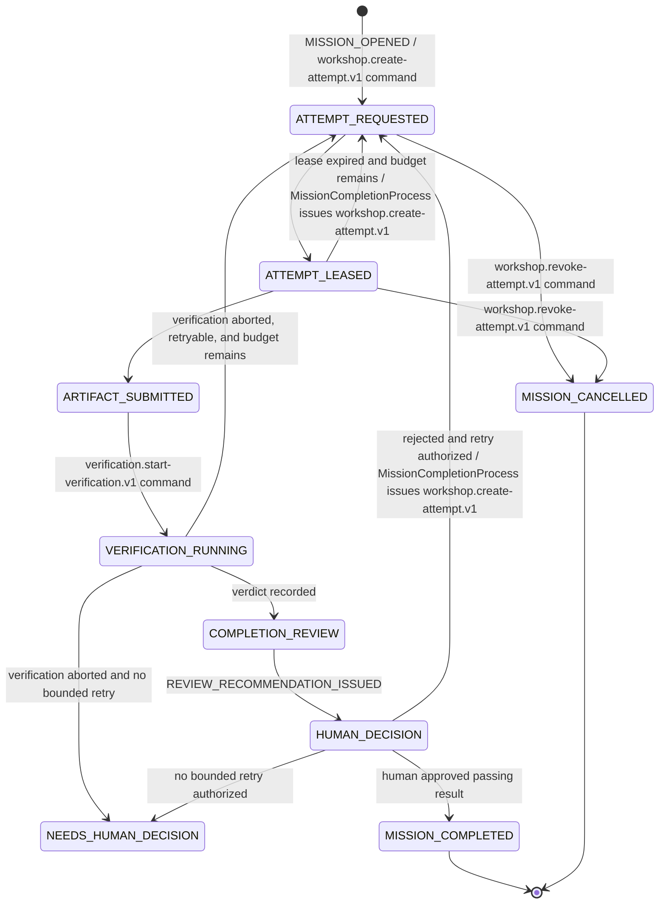

# Mission-completion workflow

`MissionCompletionProcess` is a process manager in Mission Control's
application layer. It records workflow progress, returns commands for a future
transactional outbox adapter, and exposes a validated, versioned persistence
memento for restart-safe continuation. Phase 4A does not yet provide the
database, broker, transaction, or durable-delivery adapter. The process manager
is not a domain entity, broker callback, gateway concern, or shared package.

This workflow uses orchestration, not pure choreography. The process manager
consumes published facts and issues only three provider-neutral inter-context
commands: `workshop.create-attempt.v1`,
`verification.start-verification.v1`, and `workshop.revoke-attempt.v1`. These
transport contracts are distinct from each context's internal application
commands, which are not exposed wholesale.

1. A human opens a valid mission.
   Mission Control initializes the process from the same committed application
   result that opened the Mission. That result includes the complete immutable
   work contract and `workspaceReference`; the public `mission.opened.v1` fact
   intentionally does not grow a private read-back dependency.
2. The process manager issues `workshop.create-attempt.v1` for the first
   authorized attempt. The command carries the complete immutable work
   contract: objective, starting revision, workspace reference, allowed scope,
   requested capabilities, gates, and gate-set digest. Workshop and a leasing
   runner require no hidden read back into Mission Control.
3. Workshop creates the attempt; a capable runner leases it.
4. The lease owner heartbeats and submits an immutable artifact before expiry.
5. On `workshop.artifact-submitted.v1`, the process manager issues
   `verification.start-verification.v1` for the exact mission revision, starting
   revision, gate-set digest, and artifact digest.
6. Verification publishes either a `verification.passed.v1` or
   `verification.failed.v1` gate verdict for those exact inputs. If execution
   infrastructure cannot produce a gate verdict, it instead publishes
   `verification.aborted.v1`; this is not a failed gate and opens no completion
   review. `retryable` reports whether the same bound work may be attempted
   again; it never means the aborted run itself can be converted into a verdict.
7. `CompletionReview` binds the verdict and evidence, records one immutable
   recommendation, and publishes `review.recommendation-issued.v1`.
8. Mission Control presents the bound result and recommendation to a human.
   Approval of a passing result completes the mission. Rejection archives that
   attempt's artifact, terminal verification outcome, review binding, and human
   decision before a fresh cycle clears the current binding and may authorize
   another bounded attempt with feedback when budget remains;
   `MissionCompletionProcess` then issues
   `workshop.create-attempt.v1`. A recommendation cannot perform either
   decision. Both decisions name the exact `completionReviewId`, recommendation,
   verification run, artifact digest, gate-set digest, and evidence-bundle
   digest. If a lease expires and retry budget remains, the process manager
   likewise issues `workshop.create-attempt.v1` for the next attempt.

Cancellation can interrupt active work but never erases the audit history.
When a mission is cancelled while an attempt may still be active, the process
manager issues `workshop.revoke-attempt.v1`; Workshop owns the resulting attempt
transition and publishes the outcome as a fact.
An exact duplicate or redelivery produces the same recorded business effect as
its first successful handling. Reuse of one message ID with different canonical
normalized content—and therefore a different normalized fingerprint—is a
conflict, not an idempotent duplicate. A verification run has one
first-wins terminal outcome: a materially different verdict or abort is rejected
even when it arrives under a new message ID. Each causal hop records the exact
predecessor ID needed by the next fact.

Outgoing message construction is one validated boundary: identifiers,
timestamps, actors, bounded feedback, bindings, gates, and payload topology are
checked before process state changes, then the emitted command or event is
deeply detached and frozen. Every emitted shape is tested against the root JSON
Schema definition. A matching verification-dispatch acknowledgement remains
idempotent when it arrives after the verdict, recommendation, abort, or mission
cancellation; an acknowledgement naming another command is a conflict.

Runtime validation uses one strict JSON-topology definition across aggregate
commands, private facts, translators, emitted messages, work contracts, and
mementos. Records must be ordinary `Object.prototype` objects with exact own
enumerable data properties. Lists must be ordinary dense arrays with every
index present as an own enumerable data property. Inherited or accessor-backed
fields, symbols, non-enumerable additions, custom prototypes, sparse arrays,
cycles, non-JSON containers, unsupported primitive values, non-finite numbers,
and negative zero are rejected before field access or mutation. Object and array
proxies are rejected without invoking traps via the sole, narrowly allowlisted
domain exception `node:util/types.isProxy`; canonicalization then traverses
inspected data-descriptor values rather than ordinary property reads. Frozen
ordinary JSON is accepted. Canonical normalization and SHA-256 fingerprints
share this same accepted domain, so an invalid topology cannot be silently
projected onto the fingerprint of different valid content. Process start seeds,
opening metadata, verification dispatches, retry dispatches, cancellation
metadata, public/private facts, and persistence mementos all validate their
complete exact topology before semantic field access.

`verification.aborted.v1` contains the exact verification binding and an
explicit reason. For verifier, workspace, or execution-infrastructure outages,
`retryable: true` permits the process manager to authorize a new bounded
attempt only when budget remains; it does not automatically spend budget or
resume the terminal verification run. `retryable: false`, or a retryable abort
with exhausted budget, enters `NEEDS_HUMAN_DECISION`. `MISSION_CANCELLED` is
always non-retryable and follows the cancellation transition instead. An abort
never becomes `verification.failed.v1`, never fabricates failed gate IDs, and
never produces `review.recommendation-issued.v1`.
Local cancellation followed by its exact bound `MISSION_CANCELLED` abort, and
that abort followed by the public cancellation fact, converge on the same
terminal process state. A differently bound, differently reasoned, or retryable
cancellation abort is rejected without partially mutating the process.

The process memento persists an append-only normalized transition audit. Its
`START` entry contains the complete normalized immutable seed: mission identity
and revision, correlation and opening identities, objective, workspace,
allowed scope, capabilities, gates and digests, attempt budget, and first
attempt identity. Rehydration derives the process from that audited seed—not
from the top-level projection—and requires the replayed canonical memento to
match the stored projection exactly. Every audit entry also links to the prior
entry digest so accidental or partial inconsistency is rejected.

This digest chain is a consistency check over a trusted persistence boundary,
not a signature, MAC, or proof against an attacker who can coherently rewrite
the entire store. A Phase 5 persistence adapter must protect and, where the
threat model requires it, authenticate stored mementos.

The memento also keeps a lifetime registry for every outgoing event and command
ID, a separate inbox-fact fingerprint registry, every verification dispatch,
and separate durable dispatch acknowledgements. This makes a late matching
acknowledgement for any known earlier verification command idempotent even after
a retry reset, while an unknown command ID or cross-kind ID reuse remains a
conflict. Verification-run IDs are globally fresh within the process: a run
used by any earlier attempt cannot be emitted again. Contract-valid optional
abort evidence/detail and recommendation reasons are preserved exactly through
this replay boundary.

Phase 4A exports one canonical normalized-content algorithm and SHA-256
fingerprint function for a future inbox adapter, and defines the required
`InboxPort` and unit-of-work interfaces. It does not implement or prove a
database transaction, inbox adapter, outbox adapter, or runtime atomicity.

The Phase 5 inbox adapter must implement that contract. Inside one actual
unit-of-work transaction it must first classify
`(messageId, normalizedFingerprint)` as `UNSEEN`,
`EXACT_REDELIVERY`, or `MESSAGE_ID_CONFLICT`. Only `UNSEEN` reaches the process
manager. The adapter records that same pair as processed only after business
state and outgoing intent have both been accepted; the transaction commits all
three together. This process-first ordering prevents an inbox claim from
silently consuming a message whose state transition or outbox append failed.
